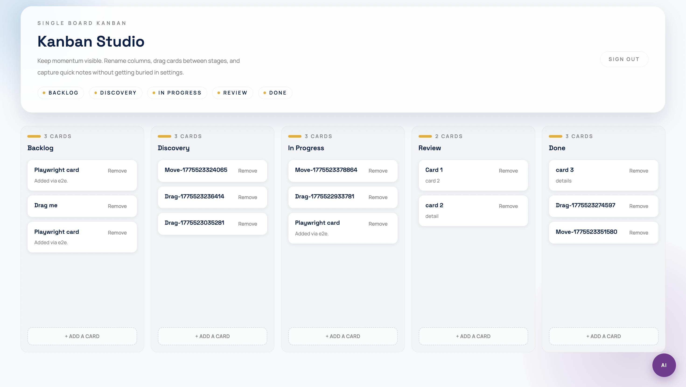

# Kanban Studio

A full-stack project management web app with an AI assistant. Built with Next.js, FastAPI, and SQLite, deployable in a single Docker container.

    



---

## Features

- Kanban board with five configurable columns (Backlog, Discovery, In Progress, Review, Done)
- Drag-and-drop card reordering within and across columns (keyboard accessible)
- Add, rename, and delete cards with optional detail text
- Inline column renaming
- AI chat assistant — describe changes in natural language and the board updates automatically
- Persistent state via SQLite; all changes survive page reloads and container restarts
- Single Docker container deployment

---

## Architecture

```
Browser
  |
  | HTTP (port 8000)
  v
FastAPI (Python)
  |-- /api/*        REST API (board, cards, AI chat)
  |-- /             Static files (pre-built Next.js)
  |
  |-- SQLite        Persistent board state (data/kanban.db)
  |-- OpenRouter    AI completions (openai/gpt-oss-120b)
```

The Dockerfile is a two-stage build:

1. **Stage 1 (Node)** — installs frontend dependencies and runs `next build`, emitting a static export to `frontend/out/`
2. **Stage 2 (Python)** — copies the static export as `static/`, installs Python dependencies with `uv`, and starts Uvicorn

FastAPI serves the pre-built Next.js site at `/` and exposes all API routes under `/api/`.

---

## Tech Stack

| Layer | Technology |
|---|---|
| Frontend framework | Next.js 16 (App Router, static export) |
| UI language | TypeScript 5 + React 19 |
| Styling | Tailwind CSS v4 |
| Drag and drop | dnd-kit (Pointer + Keyboard sensors) |
| Frontend tests | Vitest + React Testing Library |
| E2e tests | Playwright |
| Backend framework | FastAPI 0.115 |
| Language | Python 3.12 |
| Database | SQLite 3 (via `sqlite3` stdlib) |
| ORM / migrations | None — raw SQL with `CREATE TABLE IF NOT EXISTS` |
| AI provider | OpenRouter (`openai/gpt-oss-120b`) |
| AI client | OpenAI Python SDK (pointed at OpenRouter base URL) |
| Python package manager | uv |
| Container | Docker (single container, multi-stage build) |

---

## Database Schema

```
users
  id            INTEGER PRIMARY KEY AUTOINCREMENT
  username      TEXT UNIQUE NOT NULL
  password_hash TEXT NOT NULL          -- bcrypt

boards
  id      INTEGER PRIMARY KEY AUTOINCREMENT
  user_id INTEGER NOT NULL REFERENCES users(id) ON DELETE CASCADE
  title   TEXT NOT NULL DEFAULT 'My Board'

columns
  id       INTEGER PRIMARY KEY AUTOINCREMENT
  board_id INTEGER NOT NULL REFERENCES boards(id) ON DELETE CASCADE
  title    TEXT NOT NULL
  position INTEGER NOT NULL            -- 0-indexed display order

cards
  id        INTEGER PRIMARY KEY AUTOINCREMENT
  column_id INTEGER NOT NULL REFERENCES columns(id) ON DELETE CASCADE
  title     TEXT NOT NULL
  details   TEXT NOT NULL DEFAULT ''
  position  INTEGER NOT NULL           -- 0-indexed within column
```

Card and column order is maintained by a `position` integer. After every mutating operation the affected column is renormalized (positions reassigned as 0, 1, 2, …) to keep ordering stable.

---

## Quick Start (Docker)

**Prerequisites:** Docker, an [OpenRouter](https://openrouter.ai) API key.

```bash
# 1. Clone the repository
git clone <repo-url>
cd pm

# 2. Create the environment file
cp .env.example .env
# Edit .env and set OPENROUTER_API_KEY=<your-key>

# 3. Build and start the container
./scripts/start.sh

# 4. Open the app
open http://localhost:8000
```

Log in with username `user` and password `password`.

To stop the container:

```bash
./scripts/stop.sh
```

The SQLite database is stored at `data/kanban.db` on the host (bind-mounted into the container) so board state survives container restarts.

---

## Local Development

### Backend

```bash
cd backend
uv sync --dev                                          # install dependencies
uv run uvicorn main:app --reload --port 8000           # start dev server
```

The backend expects a `data/` directory at the project root for the database file. It is created automatically on first run.

Set `OPENROUTER_API_KEY` in your shell or in a `.env` file at the project root before starting the server.

### Frontend

```bash
cd frontend
npm install
npm run dev          # dev server on http://127.0.0.1:3000
```

The Next.js dev server proxies `/api/*` requests to the backend on port 8000 (configured in `next.config.ts`). Both servers must be running for the full app to work locally.

---

## Running Tests

### Backend unit tests (pytest)

```bash
cd backend
uv run pytest tests/ -v
```

Uses an in-memory SQLite database via a pytest fixture — no file I/O required.

### Frontend unit tests (Vitest)

```bash
cd frontend
npm run test                  # run once
npm run test:unit:watch       # watch mode
```

Run a single test file:

```bash
npx vitest run src/components/KanbanBoard.test.tsx
```

### End-to-end tests (Playwright)

The e2e suite requires the backend to be running on port 8000 and a real database (the tests add and remove cards).

```bash
# Terminal 1 — backend
cd backend && uv run uvicorn main:app --reload --port 8000

# Terminal 2 — run e2e tests (starts Next.js dev server automatically)
cd frontend && npm run test:e2e
```

Run all test suites at once (unit + e2e):

```bash
cd frontend && npm run test:all
```

---

## Project Structure

```
pm/
├── backend/
│   ├── main.py          # FastAPI app — all routes and helpers
│   ├── ai.py            # OpenRouter client, Pydantic AI models, system prompt
│   ├── database.py      # SQLite connection, schema creation, seeding
│   ├── pyproject.toml   # Python dependencies (uv)
│   └── tests/
│       ├── conftest.py  # In-memory DB fixture
│       └── test_*.py    # Route and logic tests
├── frontend/
│   ├── src/
│   │   ├── app/
│   │   │   └── page.tsx           # Root page — renders KanbanBoard
│   │   ├── components/
│   │   │   ├── KanbanBoard.tsx    # Board state, drag-and-drop orchestration
│   │   │   ├── KanbanColumn.tsx   # Column with header and card list
│   │   │   ├── KanbanCard.tsx     # Draggable card
│   │   │   ├── KanbanCardPreview.tsx  # Drag overlay preview
│   │   │   ├── NewCardForm.tsx    # Inline add-card form
│   │   │   ├── AIChatSidebar.tsx  # Floating AI chat widget
│   │   │   └── LoginForm.tsx      # Login screen
│   │   └── lib/
│   │       ├── kanban.ts          # Core types (Card, Column, BoardData), moveCard
│   │       └── api.ts             # Typed fetch wrappers for all API routes
│   └── tests/
│       └── kanban.spec.ts         # Playwright e2e tests
├── scripts/
│   ├── start.sh / start.bat       # Build image and run container
│   └── stop.sh / stop.bat         # Stop and remove container
├── docs/
│   └── PLAN.md                    # 10-part build plan
├── Dockerfile
├── .env.example
└── CLAUDE.md                      # Instructions for Claude Code
```

---

## AI Assistant

The AI chat widget (bottom-right corner) lets you describe board changes in plain English.

**Example interaction:**

User message:
```
Add a card called "Write integration tests" to the In Progress column with details "Cover the /api/cards endpoints".
```

The backend sends the current board state (as JSON) plus the conversation history to OpenRouter and asks for a structured response:

```json
{
  "message": "Added 'Write integration tests' to In Progress.",
  "board_update": {
    "add_cards": [
      {
        "column_id": 3,
        "title": "Write integration tests",
        "details": "Cover the /api/cards endpoints"
      }
    ],
    "move_cards": [],
    "delete_cards": [],
    "rename_columns": []
  }
}
```

The backend applies the `board_update` mutations to the database and returns the updated board to the frontend in a single response. Conversation history is maintained client-side and sent with each follow-up message.

---

## Known Limitations

This is an MVP. The following shortcuts were intentional:

- **Authentication is client-side only.** Credentials (`user` / `password`) are checked in the browser. The backend API has no auth middleware and is fully open.
- **Single user.** The database schema supports multiple users, but there is no registration flow. Only the seeded `user` account exists.
- **No real-time sync.** Changes made in one browser tab are not pushed to other tabs.
- **AI errors are surfaced as a generic message.** Partial board updates (where the AI returns malformed JSON) are silently skipped rather than rolled back.

---

## License

MIT
